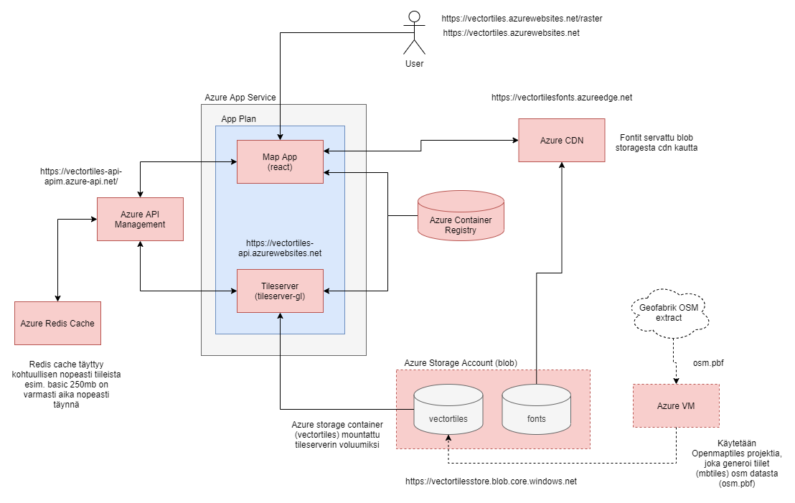

# Vectortiles viewer

Simple vectortiles viewer app (react) that uses maptiler/tileserver-gl image to serve vectortiles for client app. Additionall openmaptiles project is used to generate these tiles (mbtiles) from OpenStreetMap data (osm.pbf extract). Main purpose for this repository was to test how this infrastructure would be published to Azure infrastructure as part of Azure certification training.



## TODO

List of possible functionalities

- Map vectortiles style can be interactively altered by modifying mapbox style spesification layers properties
- Style files (json) can be imported and exported on the fly
- Add possibility for users to append external data layers to map
  - Import geojson => convert it with tippecanoe to mbtiles => make tileserver to serve it for app => user can dynamically toggle with external data (e.g. municipality borders, some simple point data)
- Style files (json) can be stored on database (noSql) (CRUD)
- Finland vectortiles set should be generated with a specific interval by Azure Function App and stored to blob storage for tileserver. Use openmaptiles for this.

## Development

### 1. Generate vectortiles (mbtiles) from OSM data extract

We use openmaptiles https://github.com/openmaptiles/openmaptiles open-source project to download Finland OSM (OpenStreetMap) data extract (http://download.geofabrik.de/) and convert it to openmaptiles compatible vectortile schema format. NOTE! This will take quite some time.

```bash
git clone https://github.com/openmaptiles/openmaptiles
cd openmaptiles
.\quickstart.sh finland-latest
```

For local use, place generated mbtiles file under /tileserver/mbtiles folder

### 2. Run docker containers

Run container individually

```bash
docker run --rm -it -v ${pwd}:/data -p 8100:80 vectortiles-tileserver
docker run --rm -it -p 3000:3000 vectortiles-map

Or with docker compose

docker compose up --build
```

### 3. Test tileserver viewer

Test following endpoints

http://localhost:3000 => for vectormap
http://localhost:3000/raster => for rastermap

## Deployment to Azure

Following topics contain information for manually constructing Azure environment

### 1. Build and push images to Azure registry

#### Build map app container

```bash
docker build -t vectortiles-map -f map/Dockerfile .
```

#### Create Azure Container Registry

Create via Azure portal

#### Push image to container registry

When image is tested locally, push it to Azure registry for Azure Web Apps

```bash
az login (or with tenant --tentant <tenant_id>)
az acr login --name <acr-name>
docker login <acr-name>.azurecr.io

docker tag vectortiles-map <acr-name>.azurecr.io/map
docker push <acr-name>.azurecr.io/map

# docker pull <acr-name>.azurecr.io/map
# docker rmi <acr-name>.azurecr.io/map
# az acr repository delete --name myregistry --image <acr-name.azurecr.io/map
```

### 2. Create Azure Storage Account (blob) and add static files

Create `vectortiles` & `fonts` containers

Vectortiles container is used for mounting tileserver tiles, style & config to running tileserver container.
- config.json
- /styles/basic.json
- /mbtiles/openmaptiles.mbtiles

Fonts container contains static font files used by tileserver. This project uses fonts found from this project https://github.com/openmaptiles/fonts

### 3. Create Azure Web Apps (map & tileserver)

Create Azure Web App Plan (linux preferrably)

Create individual apps from docker containers

#### Map app

Custom docker container

Environmental variables
- REACT_APP_TILESERVER_ENDPOINT=https://<apim-instance-name>.azure-api.net

#### Tileserver app

maptiler/tileserver-gl container

Configuration

```
- WEBSITES_ENABLE_APP_SERVICE_STORAGE=true // for persistent storage
- WEBSITES_PORT=8100
- WEBSITES_CONTAINER_START_TIME_LIMIT=1800
- WEBSITES_DISABLE_BYOS_READ_WRITE=false // tiledata app can write to mounted volume
```

Mount storage

name, mount path, type, account name, share name
tiledata /data azureblob vectortilestore vectortiles

Deployment center

Container Type = Single container
Regfistyr source = docker ghub
repository access  = public
full image name and tag ? maptiler/tileserver-gl:latest
startup file = --verbose --port 8100

##### Configuration

For SPA apps there is a need to modify web configuration to allow redirect to app root

Get FTP credentials from Map app Deployment -> Deployment Center -> FTPS credentials

Then create ftp connection (i.e. WinSCP or similar) and do following

linux machines (apache)

```
cd /home/site/wwwroot
create .htaccess file
paste following content

RewriteEngine On
RewriteRule "^[^\.]+$" "index.html"
```

windows machines (iis)

```
cd /home/site/wwwroot
create web.config file
```

### 4. Azure API Management (optional)

Optionally (tested) we can use redirect all client tileserver requests via Api Management to utilize caching tile requests. During testing Azure Redish Cache was used inside Api Management.

Api Management had following policy

```
<policies>
  <inbound>
    <base />
    <set-backend-service id="apim-generated-policy" backend-id="WebApp_vectortiles-api" />
    <cors>
      <allowed-origins>
        <origin>https://vectortiles-api.azurewebsites.net/</origin>
        <origin>https://vectortiles.azurewebsites.net/</origin>
        <origin>https://vectortilesapp.azureedge.net/</origin>
      </allowed-origins>
      <allowed-methods>
        <method>GET</method>
      </allowed-methods>
    </cors>
    <cache-lookup vary-by-developer="false" vary-by-developer-groups="false" downstream-caching-type="none" caching-type="external">
      <vary-by-header>Accept</vary-by-header>
      <vary-by-header>Accept-Charset</vary-by-header>
      <vary-by-header>Authorization</vary-by-header>
    </cache-lookup>
  </inbound>
  <backend>
    <base />
  </backend>
  <outbound>
    <base />
    <cache-store duration="3600" />
  </outbound>
  <on-error>
    <base />
  </on-error>
</policies>
```

Change map client endpoint REACT_APP_TILESERVER_ENDPOINT=https://<apim-instance-name>.azure-api.net

### 5. Azure CDN (optional)

Also Azure CDN was used to cache fonts & map application.

tileserver style config was changed to use CDN to request fonts

glyphs => https://vectortilesfonts.azureedge.net/{fontstack}/{range}.pbf

